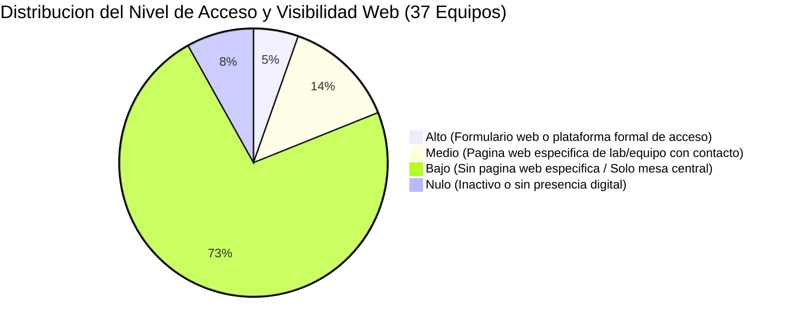

# Auditoría de Acceso a la Información y Visibilidad Web del Equipamiento Científico (Macrozona Austral)

Este informe presenta una auditoría empírica e independiente sobre la disponibilidad pública en internet, el tipo de presencia digital, los canales de contacto visibles en la web y los mecanismos de solicitud de acceso para los **37 equipos científicos mayores y medianos** catastrados en las regiones de Aysén y de Magallanes y de la Antártica Chilena (a partir del universo de activos del archivo `Catastro_v4.csv`).

---

## 1. Diagnóstico General de Visibilidad y Acceso Digital

A pesar de que el equipamiento científico mayor y mediano en la Macrozona Austral ha sido financiado fundamentalmente con fondos públicos del Estado chileno (**ANID**, FONDEQUIP, Centros de Excelencia, Gobiernos Regionales vía **FNDR / FIC**), los cuales exigen normativamente el **acceso abierto y el uso compartido interinstitucional**, la auditoría web revela un escenario de **alta opacidad digital y marcada fragmentación**:

1. **Predominio del Acceso Indirecto / Mínima Presencia Web (73.0% de los equipos):** 27 de los 37 equipos catastrados **no poseen una página web propia, ficha técnica descargable ni canal de contacto directo publicado en internet**. Un investigador externo que busque utilizarlos solo encontrará menciones secundarias en noticias de prensa general, registros de proyectos [ANID](https://anid.cl) o publicaciones científicas (papers), debiendo recurrir a mesas centrales genéricas (OIRS, oficinas de partes o correos generales de centros) sin certeza de derivación técnica.
2. **Presencia Institucional Específica sin Plataforma de Reserva (13.5% de los equipos):** 5 equipos disponen de una página web específica dentro de su institución (como las subpáginas de laboratorios de la Universidad de Aysén o la sección de equipamiento de COPAS Coastal). Si bien estas páginas describen las capacidades analíticas e identifican a los investigadores a cargo, **carecen de calendarios de disponibilidad, tarifarios públicos y formularios de reserva en línea**.
3. **Mecanismos Formales y Plataformas Estandarizadas de Acceso (5.4% de los equipos - Nivel Alto):** 
   - El [Formulario Digital de Solicitud de Acceso al SEM Zeiss EVO 15](https://docs.google.com/forms/d/1wVbnAAEpA_NSauq0VjJXOcXSNFm5-uV6b-qMgJvFNFY/viewform) del **Museo Regional de Aysén (MURAY / SERPAT)** cuenta con un formulario web público estandarizado, requisitos técnicos explícitos, compromisos de coautoría/agradecimientos y criterios transparentes de priorización territorial.
   - La **Estación Patagonia UC (Pontificia Universidad Católica de Chile)** dispone de una plataforma formal dentro de la [Red de Centros y Estaciones Regionales UC (RCER UC)](https://rcer.uc.cl) que estructura el protocolo de solicitud de estadías científicas, uso de infraestructura de terreno y acceso a sus instrumentos meteorológicos en Bahía Exploradores.
4. **Inoperatividad Digital y Activos Inactivos (8.1% de los equipos):** 3 equipos se encuentran fuera de operación (por fallas de mantenimiento o embalados en cajas), sin ninguna presencia digital que informe a la comunidad científica sobre su estado.

---

## 2. Escala de Categorización del Nivel de Acceso Web

La evaluación de los 37 equipos se rige estrictamente por lo que un usuario externo puede descubrir y gestionar **exclusivamente a través de la web pública**:

*   **Alto (Acceso Abierto, Transparente y Formalizado):** El equipo cuenta con presencia web activa y específica, información técnica detallada, **formulario de solicitud directo o plataforma digital formal de acceso/reserva**, canales de contacto explícitos y condiciones de uso/requisitos claramente estipulados en la web.
*   **Medio (Acceso Vía Gestión Directa / Contacto Identificable en la Web):** El equipo figura explícitamente en una **página web dedicada** (subpágina de laboratorio, ficha técnica de equipamiento del centro o portal temático), donde se identifica públicamente en la web al responsable o canal institucional directo para gestionar el uso, aunque carece de formulario automatizado y tarifario en línea.
*   **Bajo (Acceso Indirecto / Mínima Presencia Web):** El equipo **no posee página web dedicada ni canal de contacto directo visible en internet**. Solo es rastreable mediante registros de proyectos ANID/FNDR, menciones generales en papers o noticias históricas. Para solicitar acceso, el usuario externo debe contactar a casillas genéricas institucionales (ej. `contacto@`, `oirs@`, `vrip@`, `cere@`, `vridei@`) sin garantías de derivación técnica.
*   **Nulo (Sin Disponibilidad / Inoperatividad Digital):** Equipamiento inactivo, almacenado en bodega sin instalación o fuera de servicio por fallas de mantenimiento, sin presencia digital ni canales disponibles para su uso.

---

## 3. Matriz de Auditoría Web por Equipamiento (37 Equipos)

> **Nota metodológica:** La columna *Canal de Contacto Visible en la Web* refleja únicamente los correos, formularios o teléfonos que están **efectivamente publicados y accesibles para cualquier persona en la web**, excluyendo cualquier dato privado del catastro interno.

| ID | Institución | Nombre del Equipamiento | Modelo / Marca | Tipo de Presencia Web y Enlace Específico | Canal de Contacto Visible en la Web | Tarifas y Condiciones Públicas en Línea | Nivel de Acceso Web |
| :---: | :--- | :--- | :--- | :--- | :--- | :--- | :---: |
| **01** | **U. de Aysén** | Microscopio de Fuerzas Atómicas (AFM) | Asylum Research Infinity BIO | Página web oficial del laboratorio: [Laboratorio de Microscopía de Fuerza Atómica](https://uaysen.cl/investigacion/laboratorios/laboratorio-de-microscopia-de-fuerza-atomica/) | Identifica en la web al director (Dr. Felipe Aguilar). Correo central UAY: `partes@uaysen.cl` | No publicadas | **Medio** |
| **02** | **U. de Aysén** | Analizador de Metabolismo Celular Seahorse | Agilent Seahorse XF Pro | Página web oficial del laboratorio: [Laboratorio de Fisiología Celular y Metabolismo](https://uaysen.cl/investigacion/laboratorios/laboratorio-de-fisiologia-celular-y-metabolismo/) | Identifica en la web a los directores (Dr. Fabián Jaña / Dra. Carla Basualto). Correo central: `partes@uaysen.cl` | No publicadas | **Medio** |
| **03** | **U. de Aysén** | Citómetro de Flujo Espectral Cytek Aurora | Cytek Biosciences Aurora (3 láseres) | Página web oficial del laboratorio: [Laboratorio de Morfotoxicología](https://uaysen.cl/investigacion/laboratorios/laboratorio-de-morfotoxicologia/) | Identifica en la web al director (Dr. Aldo Villalón). Correo central UAY: `partes@uaysen.cl` | No publicadas | **Medio** |
| **04** | **U. de Aysén** | Dron Multiespectral Tetracam | Microdrones MD4-1000 / Macaw-T | Sin página web ni ficha institucional ([uaysen.cl](https://uaysen.cl)) | Ninguno disponible en la web | Inactivo por falla de mantenimiento | **Nulo** |
| **05** | **CIEP** | Cromatógrafo Iónico Dionex | Dionex ICS-5000 / ICS-6000 DP | Sin ficha web específica del equipo. Solo portal general de líneas científicas ([ciep.cl/inicio](https://ciep.cl/inicio/)) | Mesa central del centro: `contacto@ciep.cl` (Tel: +56 67 2244549) | No publicadas en la web | **Bajo** |
| **06** | **CIEP** | Microanalizador Elemental CHN | Leco TruSpec Micro | Sin ficha web específica del equipo. Solo portal general de líneas científicas ([ciep.cl/inicio](https://ciep.cl/inicio/)) | Mesa central del centro: `contacto@ciep.cl` (Tel: +56 67 2244549) | No publicadas en la web | **Bajo** |
| **07** | **CIEP** | Analizador TOC/TN Disuelto | Shimadzu TOC-L CPH/CPN | Sin ficha web específica del equipo. Solo portal general de líneas científicas ([ciep.cl/inicio](https://ciep.cl/inicio/)) | Mesa central del centro: `contacto@ciep.cl` (Tel: +56 67 2244549) | No publicadas en la web | **Bajo** |
| **08** | **CIEP** | Espectrofluorímetro Aqualog | Horiba Aqualog-UV-800-C | Sin ficha web específica del equipo. Solo portal general de líneas científicas ([ciep.cl/inicio](https://ciep.cl/inicio/)) | Mesa central del centro: `contacto@ciep.cl` (Tel: +56 67 2244549) | No publicadas en la web | **Bajo** |
| **09** | **INACH** | Plataforma Oceanográfica Subsuperficial | MTE Lander Aural concerto CTD | Sin ficha web específica del equipo. Portal institucional de laboratorios ([inach.cl/laboratorios](https://www.inach.cl/inach/?page_id=23348)) | Mesa central institucional: `inach@inach.cl` / OIRS | En proceso de adquisición / PROCIEN | **Bajo** |
| **10** | **INACH** | Sistema Autónomo Ferrybox | 4H-Jena FerryBox I | Sin ficha web específica del equipo. Portal institucional de laboratorios ([inach.cl/laboratorios](https://www.inach.cl/inach/?page_id=23348)) | Mesa central institucional: `inach@inach.cl` / OIRS | En proceso de adquisición / PROCIEN | **Bajo** |
| **11** | **INACH** | Microtomógrafo de Rayos X (Micro CT) | Bruker SkyScan 1272 / 1273 | Sin catálogo web de servicios. Solo notas de divulgación de proyectos paleontológicos ([www.inach.cl](https://www.inach.cl)) | Mesa central institucional: `inach@inach.cl` / OIRS | No publicadas en la web | **Bajo** |
| **12** | **INACH** | Glider Submarino Autónomo | Alseamar SEAEXPLORER X2 | Sin ficha web de servicio. Mención en notas de expedición polar ([www.inach.cl](https://www.inach.cl)) | Mesa central institucional: `inach@inach.cl` / OIRS | No publicadas en la web | **Bajo** |
| **13** | **INACH** | Plataforma Secuenciación Buque Viel | Oxford Nanopore / TBD | Sin ficha web de servicio. Mención en prensa sobre el buque Viel ([www.inach.cl](https://www.inach.cl)) | Mesa central institucional: `inach@inach.cl` / OIRS | No publicadas en la web | **Bajo** |
| **14** | **UACh** | Sistema Ferrybox Fiordos | 4H-Jena FerryBox I | Sin presencia web ([uach.cl](https://www.uach.cl)) | Ninguno disponible en la web | Inactivo por falta de mantenimiento | **Nulo** |
| **15** | **UACh** | Perfilador Atmosférico SODAR-RASS | Scintec XFAS-RAE1 / MFAS | Sin ficha web en el portal de la universidad. Mención en prensa regional de Aysén ([uach.cl](https://www.uach.cl)) | Directorio institucional general UACh / Mesa central | No publicadas en la web | **Bajo** |
| **16** | **UMAG** | Plataforma Microscopía Avanzada MIRAS | Zeiss LSM 900 / EVO 15 / Axio | Sin catálogo web de equipamiento en la universidad. Portal VRIP general ([umag.cl/vrip](https://umag.cl/vicerrectoria-de-investigacion-innovacion-y-postgrado/)) | Mesa central VRIP UMAG: `vrip@umag.cl` | No publicadas en la web | **Bajo** |
| **17** | **UMAG** | Espectrómetro RMN de Sobremesa | Nanalysis NMReady-60PRO | Sin ficha web de equipamiento. Menciones en prensa institucional ([umag.cl](https://www.umag.cl)) | Mesa central VRIP UMAG: `vrip@umag.cl` | No publicadas en la web | **Bajo** |
| **18** | **UMAG** | Analizador TOC/TN Multi N/C | Analytik Jena Multi N/C 3100 Duo | Sin catálogo web de equipamiento. Portal general CADI-UMAG / VRIP ([umag.cl/vrip](https://umag.cl/vicerrectoria-de-investigacion-innovacion-y-postgrado/)) | Mesa central VRIP UMAG: `vrip@umag.cl` | No publicadas en la web | **Bajo** |
| **19** | **UMAG** | Plataforma Estaciones Eddy Covariances | Campbell / LI-COR (LI-7200RS) | Mención general en portal del parque ([rcer.uc.cl/parque-omora](https://rcer.uc.cl/centros-y-estaciones/parque-etnobotanico-omora)). Sin ficha de reserva | Contacto general Red RCER UC / Omora | No publicadas en la web | **Bajo** |
| **20** | **COPAS Coastal** | Embarcación Científica Sur-Austral | Lancha Científica Sur-Austral | Ficha específica en sección oficial de equipamiento: [Equipamiento COPAS Coastal](https://copas-coastal.cl/equipamiento/) y [Viaje Inaugural](https://copas-coastal.cl/viaje-inaugural-rv-sur-austral/) | Correo institucional del centro: `copas@udec.cl` | No publicadas (Declara tarifa por hora/día) | **Medio** |
| **21** | **COPAS Coastal** | Imaging FlowCytobot (IFCB) | McLane Imaging FlowCytobot | Ficha específica en sección oficial de equipamiento: [Equipamiento COPAS Coastal](https://copas-coastal.cl/equipamiento/) | Correo institucional del centro: `copas@udec.cl` | No publicadas (Declara tarifa por muestra/mes) | **Medio** |
| **22** | **INIA** | Analizador Elemental Dumas CN | Velp Scientifica CN 802 | Sin catálogo de equipamiento en la web institucional. Portal general ([www.inia.cl](https://www.inia.cl)) | Mesa central nacional: `contacto@inia.cl` / Centro Regional Tamel Aike | No publicadas en la web | **Bajo** |
| **23** | **Museo Aysén** | Microscopio SEM Zeiss con EDX | Zeiss EVO 15 + Oxford EDS | Portal oficial del museo ([museoregionalaysen.gob.cl](https://www.museoregionalaysen.gob.cl)) con formulario digital de acceso | **[Formulario Digital (Google Forms)](https://docs.google.com/forms/d/1wVbnAAEpA_NSauq0VjJXOcXSNFm5-uV6b-qMgJvFNFY/viewform)** / `contactoaysen@museoschile.gob.cl` | **Sí** (Requisitos técnicos y criterios de coautoría explícitos) | **Alto** |
| **24** | **INIA** | Planta Generadora Nitrógeno Líquido | Shanghai Hengcang / Stirling | Sin catálogo de servicios en la web. Portal general ([www.inia.cl](https://www.inia.cl)) | Mesa central nacional: `contacto@inia.cl` / Centro Regional Tamel Aike | No publicadas en la web | **Bajo** |
| **25** | **INIA** | Congelador Semen IceCube 14 | SY-LAB / Minitube IceCube 14 | Sin catálogo de servicios en la web. Portal general ([www.inia.cl](https://www.inia.cl)) | Mesa central nacional: `contacto@inia.cl` / Centro Regional Tamel Aike | No publicadas en la web | **Bajo** |
| **26** | **INIA** | Envasadora/Selladora de Pajuelas Uno | Minitube Uno | Sin catálogo de servicios en la web. Portal general ([www.inia.cl](https://www.inia.cl)) | Mesa central nacional: `contacto@inia.cl` / Centro Regional Tamel Aike | No publicadas en la web | **Bajo** |
| **27** | **INIA** | Sistema CASA SpermVision | Minitube SpermVision CASA | Sin catálogo de servicios en la web. Portal general ([www.inia.cl](https://www.inia.cl)) | Mesa central nacional: `contacto@inia.cl` / Centro Regional Tamel Aike | No publicadas en la web | **Bajo** |
| **28** | **U. de Aysén** | Base de Luz Transmitida Leica TL | Leica Microsystems TL5000 / TL-LED | Mención general en [Laboratorio de Ciencias Naturales y Tecnología](https://uaysen.cl/investigacion/laboratorios/laboratorio-de-ciencias-naturales-y-tecnologia/). Sin ficha de equipo | Correo central UAY: `partes@uaysen.cl` | No publicadas | **Bajo** |
| **29** | **Estación Patagonia UC** | Estación Meteorológica THIES DL16 Pro | Thies Clima Datalogger DL16 Pro | Plataforma institucional de la [Red de Centros y Estaciones Regionales UC (RCER UC)](https://rcer.uc.cl) | Canal institucional formal visible en la web: `epii@uc.cl` / Plataforma RCER UC | **Sí** (Protocolo formal de solicitud de estadía y uso de infraestructura) | **Alto** |
| **30** | **UMAG** | Equipo Triaxial Dinámico | Dynatriax Electromechanical DmS | Sin página web de equipamiento en la Facultad de Ingeniería ([umag.cl](https://www.umag.cl)) | Mesa central VRIP UMAG: `vrip@umag.cl` | No publicadas en la web | **Bajo** |
| **31** | **UMAG** | Estación Meteorológica Automática | Campbell Scientific | Página oficial del instituto: [Instituto de la Patagonia](https://umag.cl/vicerrectoria-de-investigacion-innovacion-y-postgrado/instituto-de-la-patagonia/) | Correo institucional visible en la web: `director.ip@umag.cl` | No publicadas en la web | **Bajo** |
| **32** | **UMAG** | Estaciones Meteorológicas (3 unidades) | Campbell Scientific | Sin presencia web ([umag.cl](https://www.umag.cl)) | Ninguno disponible en la web | Inactivas (embaladas en cajas por falta de insumos) | **Nulo** |
| **33** | **UMAG** | Dron Multiespectral DJI Mavic 3M | DJI Mavic 3 Multiespectral | Sin catálogo web de equipamiento en Cs. Agropecuarias ([umag.cl](https://www.umag.cl)) | Mesa central VRIP UMAG: `vrip@umag.cl` | No publicadas en la web | **Bajo** |
| **34** | **USACH** | Mini Micro Pulso Lidar (Base Escudero) | SigmaSpace MPL-4B-IDS-532-AT | Sin ficha web de servicio en portal USACH. Mención en prensa científica ([usach.cl](https://www.usach.cl)) | Vicerrectoría de Investigación USACH: `vridei@usach.cl` / Mesa central | No publicadas en la web | **Bajo** |
| **35** | **USACH** | Espectroradiómetro Multicanal (Base Escudero) | Bentham Prede DMC150 POMO1 | Sin catálogo de servicios en la web institucional ([usach.cl](https://www.usach.cl)) | Vicerrectoría de Investigación USACH: `vridei@usach.cl` / Mesa central | No publicadas en la web | **Bajo** |
| **36** | **UMAG** | Perfilador de Viento SODAR-SFAS (CERE) | Scintec SFAS | Portal web del [Centro de Estudios de los Recursos Energéticos (CERE-UMAG)](https://cere.umag.cl). Sin ficha de reserva | Correo institucional del centro: `cere@umag.cl` (Tel: +56 61 2207182) | No publicadas en la web | **Bajo** |
| **37** | **UMAG** | Sistema Modular de Hidrógeno (Electrolizador 20 kW y Celda 10 kW) | Sistema modular de electrólisis y celda | Difusión institucional en portal [CERE-UMAG](https://cere.umag.cl). Activo en fase de implementación | Correo institucional del centro: `cere@umag.cl` / `vicerrectoria.investigacion@umag.cl` | No publicadas en la web | **Bajo** |

---

## 4. Análisis Detallado por Institución y Capacidad de Gestión Web

### 4.1. Universidad de Aysén (UAY) - 5 Equipos
*   **Equipos Registrados:** Microscopio de Fuerzas Atómicas (AFM), Analizador Seahorse XF Pro, Citómetro Cytek Aurora, Dron Multiespectral Tetracam (Inactivo) y Base de Luz Transmitida Leica TL5000.
*   **Evaluación de la Web Pública:** 
    *   La Universidad de Aysén cuenta con páginas web individuales para sus laboratorios de investigación: [Laboratorio de Microscopía de Fuerza Atómica](https://uaysen.cl/investigacion/laboratorios/laboratorio-de-microscopia-de-fuerza-atomica/), [Laboratorio de Fisiología Celular y Metabolismo](https://uaysen.cl/investigacion/laboratorios/laboratorio-de-fisiologia-celular-y-metabolismo/) y [Laboratorio de Morfotoxicología](https://uaysen.cl/investigacion/laboratorios/laboratorio-de-morfotoxicologia/).
    *   En dichas páginas se detallan las especificaciones de los equipos (AFM MFP3D Infinity Bio, Seahorse XF Pro, Cytek Aurora) y se nombra públicamente a sus directores académicos (Dr. Felipe Aguilar, Dr. Fabián Jaña, Dra. Carla Basualto, Dr. Aldo Villalón).
    *   **Canales y Brechas:** No se publican casillas de correo directo de los directores en las páginas de los laboratorios ni formularios de reserva en línea (solo figura el correo institucional de partes `partes@uaysen.cl` y la casilla general de admisión). Por ello, los tres equipos principales se clasifican como nivel **Medio**. La Base Leica (mención genérica) se clasifica en **Bajo** y el Dron Tetracam (inactivo) en **Nulo**.

### 4.2. Centro de Investigación en Ecosistemas de la Patagonia (CIEP) - 4 Equipos
*   **Equipos Registrados:** Cromatógrafo Iónico Dionex, Microanalizador Elemental CHN Leco, Analizador TOC/TN Shimadzu, Espectrofluorímetro Aqualog.
*   **Evaluación de la Web Pública:**
    *   El sitio web institucional ([Portal Oficial CIEP](https://ciep.cl/inicio/)) describe las líneas de investigación científica del centro, pero **no posee una sección web de catálogo de laboratorios ni fichas técnicas para su instrumental analítico**.
    *   **Canales y Brechas:** No hay canales de contacto por laboratorio publicados en la web. La única vía visible para un usuario externo es el correo central `contacto@ciep.cl` o el conmutador telefónico. Los cuatro equipos se clasifican en nivel **Bajo**.

### 4.3. Instituto Antártico Chileno (INACH) - 5 Equipos
*   **Equipos Registrados:** Plataforma Oceanográfica Subsuperficial (Lander/CTD), Sistema Autónomo Ferrybox, Microtomógrafo Bruker SkyScan 1272/1273, Glider Submarino SeaExplorer X2, Secuenciador a bordo del Rompehielos Viel.
*   **Evaluación de la Web Pública:**
    *   La página de [Laboratorios Embajador Jorge Berguño Barnes](https://www.inach.cl/inach/?page_id=23348) describe de forma global las instalaciones en Punta Arenas. Las menciones al Microtomógrafo, Glider y Buque Viel aparecen en notas de prensa sobre expediciones polares.
    *   **Canales y Brechas:** No existe un catálogo de servicios para investigadores externos ni un formulario de reserva de instrumental. El canal de acceso público es la mesa general `inach@inach.cl` / OIRS. Todos sus activos clasifican en nivel **Bajo**.

### 4.4. Universidad Austral de Chile (UACh - Campus Patagonia) - 2 Equipos
*   **Equipos Registrados:** Sistema Ferrybox (Inactivo) y Perfilador Atmosférico SODAR-RASS Scintec.
*   **Evaluación de la Web Pública:**
    *   En el portal de la universidad ([Universidad Austral de Chile](https://www.uach.cl)) no existe una ficha ni módulo de servicio para el SODAR-RASS; solo existen menciones en la prensa regional sobre monitoreo ambiental.
    *   **Canales y Brechas:** El SODAR-RASS clasifica en nivel **Bajo** (requiere contactar a la mesa central o buscar al académico en noticias) y el Ferrybox en **Nulo** (inactivo).

### 4.5. Universidad de Magallanes (UMAG) - 10 Equipos
*   **Equipos Registrados:** Plataforma MIRAS Magallanes, Espectrómetro RMN Nanalysis, Analizador TOC/TN Analytik Jena, Plataforma Eddy Covariances, Triaxial Dinámico de Geotecnia, Estación Meteorológica Campbell activa (Inst. Patagonia), Estaciones Meteorológicas Campbell inactivas en caja (3 un.), Dron DJI Mavic 3M, Perfilador de Viento SODAR-SFAS (CERE-UMAG), y Sistema Modular de Hidrógeno / Electrolizador (CERE-UMAG).
*   **Evaluación de la Web Pública:**
    *   La universidad difunde sus capacidades a través del portal de la [Vicerrectoría de Investigación, Innovación y Postgrado UMAG](https://umag.cl/vicerrectoria-de-investigacion-innovacion-y-postgrado/), la página del [Instituto de la Patagonia](https://umag.cl/vicerrectoria-de-investigacion-innovacion-y-postgrado/instituto-de-la-patagonia/) y el portal del [Centro de Estudios de los Recursos Energéticos (CERE-UMAG)](https://cere.umag.cl).
    *   El CERE cuenta con un sitio web independiente (`cere.umag.cl`) con descripción de sus líneas de investigación en energía eólica, hidrógeno verde y una sección de equipamiento e instrumentación (`cere.umag.cl/equipamiento-e-instrumentacion/`). Sin embargo, ni el SODAR-SFAS ni el sistema modular de hidrógeno (electrolizador 20 kW / celda 10 kW) disponen de formularios de solicitud o agendas públicas de servicio para investigadores externos.
    *   **Canales y Brechas:** Los canales visibles en la web son las casillas centrales `vrip@umag.cl`, `director.ip@umag.cl` y `cere@umag.cl`. 9 equipos se encuentran en nivel **Bajo** y las 3 estaciones en caja en nivel **Nulo**.

### 4.6. COPAS Coastal (Centro Oceanográfico / Sede Tortel) - 2 Equipos
*   **Equipos Registrados:** Embarcación Científica Sur-Austral e Imaging FlowCytobot (IFCB McLane).
*   **Evaluación de la Web Pública:**
    *   COPAS Coastal cuenta con una sección web específica de [Equipamiento Científico](https://copas-coastal.cl/equipamiento/) donde describe detalladamente el rol de la Lancha Sur-Austral y del citómetro sumergible IFCB instalado en Caleta Tortel.
    *   **Canales y Brechas:** La página publica el correo de contacto institucional `copas@udec.cl`. Al contar con fichas técnicas específicas en la web y contacto del centro, ambos equipos clasifican en nivel **Medio**.

### 4.7. Instituto de Investigaciones Agropecuarias (INIA) - 5 Equipos
*   **Equipos Registrados:** Analizador Dumas CN 802, Generador de Nitrógeno Líquido, Congelador de Semen IceCube 14, Envasadora de Pajuelas Uno, Sistema CASA SpermVision.
*   **Evaluación de la Web Pública:**
    *   El sitio web [INIA Chile](https://www.inia.cl) no cuenta con un módulo de cotización ni catálogo público de sus laboratorios de biotecnología reproductiva ovina en Aysén (Predio Santa Elena / Tamel Aike).
    *   **Canales y Brechas:** Solo se dispone de la mesa central nacional `contacto@inia.cl`. Los 5 equipos clasifican en nivel **Bajo**.

### 4.8. Museo Regional de Aysén (MURAY / SERPAT) - 1 Equipo (Caso Ejemplar)
*   **Equipos Registrados:** Microscopio Electrónico de Barrido (SEM) ZEISS EVO 15 con EDS Oxford.
*   **Evaluación de la Web Pública (Nivel Alto):**
    *   Dispone de un canal formal estructurado mediante un [Google Form de Solicitud de Uso del SEM](https://docs.google.com/forms/d/1wVbnAAEpA_NSauq0VjJXOcXSNFm5-uV6b-qMgJvFNFY/viewform) enlazado a la gestión del museo ([museoregionalaysen.gob.cl](https://www.museoregionalaysen.gob.cl)), con requisitos de muestras, calendarización y criterios de colaboración científica claramente normados.

### 4.9. Estación Patagonia UC - 1 Equipo (Nivel Alto)
*   **Equipos Registrados:** Estación Meteorológica Automática THIES DL16 Pro (Bahía Exploradores).
*   **Evaluación de la Web Pública (Nivel Alto):**
    *   Figura en la plataforma institucional de la [Red de Centros y Estaciones Regionales UC (RCER UC)](https://rcer.uc.cl). La red dispone de un protocolo formalizado y público para la postulación a estadías científicas de investigación en terreno, acceso a la infraestructura de Bahía Exploradores y uso coordinado de sus bases de datos e instrumental meteorológico, centralizado en el canal visible `epii@uc.cl`.

### 4.10. Universidad de Santiago de Chile (USACH - Base Escudero Antártica) - 2 Equipos
*   **Equipos Registrados:** Mini Micro Pulso Lidar (SigmaSpace MPL-4B-IDS-532-AT) y Espectroradiómetro Multicanal (Bentham Prede DMC150 POMO1), operados en la Base Antártica Profesor Julio Escudero (Isla Rey Jorge).
*   **Evaluación de la Web Pública:**
    *   Ambos instrumentos fueron adquiridos mediante fondos FONDEQUIP (liderados por el Dr. Raúl Cordero). Su actividad científica cuenta con amplia difusión en notas de prensa sobre cambio climático y física atmosférica polar ([Universidad de Santiago de Chile](https://www.usach.cl)).
    *   **Canales y Brechas:** No existe un catálogo ni formulario de reserva para que investigadores externos soliciten mediciones o tiempo de uso en estos equipos. El canal formal en la web es la [Vicerrectoría de Investigación, Innovación y Creación USACH](https://vridei.usach.cl) (`vridei@usach.cl`) o el contacto académico general. Ambos clasifican en nivel **Bajo**.

---

## 5. Análisis Comparativo de Brechas Web en la Macrozona Austral

| Dimensión Crítica | Diagnóstico Empírico en la Web Pública | Impacto Operacional |
| :--- | :--- | :--- |
| **Existencia de Ficha Web Específica** | **Solo el 18.9% de los equipos (7/37)** cuenta con una página web o sección dedicada en el portal institucional. El 81.1% es invisible o genérico. | Desconocimiento por parte de investigadores externos y empresas sobre las capacidades reales existentes en la región. |
| **Canales de Solicitud Estandarizados** | **Solo el 5.4% (2/37)** cuenta con formulario web público o plataforma formalizada de acceso (Museo Regional de Aysén y Estación Patagonia UC). El 94.6% depende de correos informales o mesas OIRS. | Barrera de entrada para la colaboración interinstitucional, falta de trazabilidad y tiempos de respuesta indeterminados. |
| **Transparencia en Tarifarios y Requisitos** | **0% de los equipos** publica sus listas de precios por muestra/hora o manuales de preparación de muestras en la web. | Imposibilidad de presupuestar análisis en proyectos concursables (FONDECYT/Anillos) sin rondas previas de consultas informales. |
| **Monitoreo de Estado Operativo** | **8.1% de los equipos catastrados (3/37)** está inactivo o guardado sin que exista información pública al respecto. | Riesgo de solicitar equipos inoperativos y desaprovechamiento de garantías o fondos de mantenimiento. |

---

## 6. Recomendaciones Estratégicas para el Nodo Ciencia Austral

1. **Creación del Portal Centralizado de Equipamiento Científico Austral:**
   Desarrollar un catálogo digital unificado bajo el alero del Nodo Ciencia Austral que consolide las fichas técnicas, fotografías, capacidades analíticas y estados operativos de los 37 equipos de la macrozona.
2. **Estandarización de Formularios Digitales de Solicitud:**
   Replicar e institucionalizar el modelo del Museo Regional de Aysén y la Estación Patagonia UC mediante un sistema único de solicitud web interoperable para todas las instituciones del Nodo (UAY, UMAG, CIEP, INACH, UACh, COPAS, INIA, MURAY, UC, USACH).
3. **Publicación Abierta de Reglamentos de Uso y Esquemas de Costos:**
   Establecer como compromiso del Nodo la publicación transparente de los protocolos de preparación de muestras, estándares de bioseguridad y matrices de costos para usuarios académicos externos.
