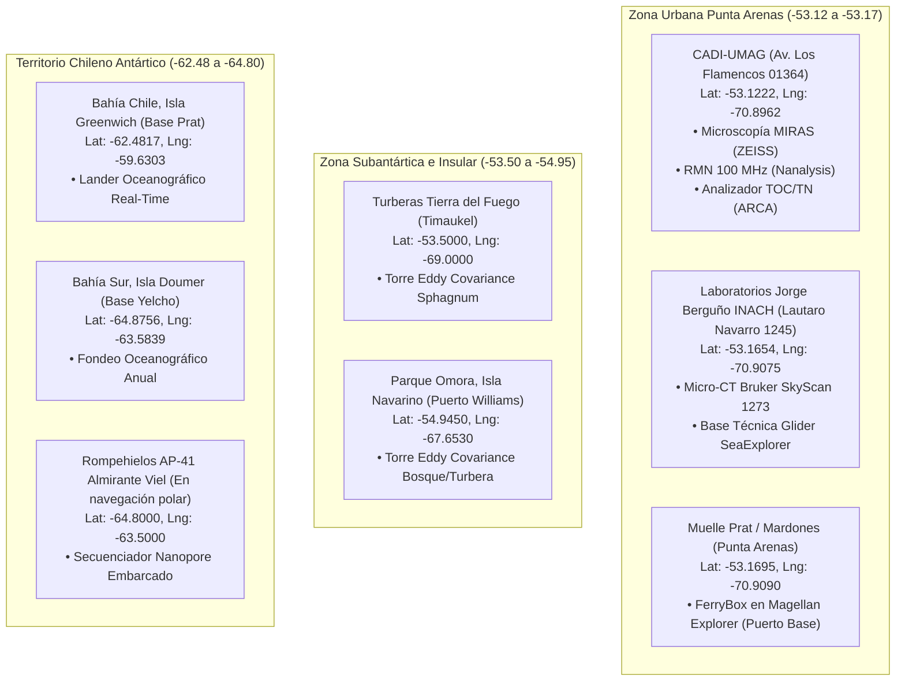

# Auditoría Exhaustiva de Ubicaciones Físicas y Coordenadas Geográficas: INACH y UMAG

El presente informe contiene el **chequeo exhaustivo y verificación geográfica de las ubicaciones físicas, sedes, edificios, buques y estaciones de terreno**, junto con sus **latitudes y longitudes correlativas exactas**, para los 5 equipamientos del **Instituto Antártico Chileno (INACH)** y los 4 equipamientos de la **Universidad de Magallanes (UMAG)** catastrados en el Nodo Ciencia Austral.

---

## 🧭 Resumen de Hallazgos y Diagnóstico

### 1. Hallazgos en el Instituto Antártico Chileno (INACH)
*   **Micro-CT (Bruker SkyScan 1273):** Se encontraba asignado a *Plaza Muñoz Gamero 1055* (sede administrativa central). La ubicación física real de los laboratorios científicos y el equipo es el **Edificio de Laboratorios Antárticos "Embajador Jorge Berguño Barnes", en calle Lautaro Navarro 1245, Punta Arenas** (`-53.1654, -70.9075`).
*   **Lander Subsuperficial ($906M):** Estaba erróneamente rotulado en *Bahía Fildes (Isla Rey Jorge)*. El proyecto oficial FONDEQUIP Mayor 2024 instala el *Lander* con transmisión en tiempo real en **Bahía Chile (Isla Greenwich, Shetland del Sur, junto a Base Prat: Lat -62.4817, Lng -59.6303)** y el anclaje anual en **Bahía Sur (Isla Doumer, Archipiélago Palmer, junto a Base Yelcho: Lat -64.8756, Lng -63.5839)**.
*   **FerryBox Antártico (EQM240009):** Se vinculó inicialmente al *AP Almirante Viel*, pero el proyecto oficial ANID adjudicado es la alianza con *Antarctica21* en el buque crucero polar ***Magellan Explorer***, que opera entre **Punta Arenas (Muelle Capitán Prat / Mardones: Lat -53.1695, Lng -70.9090)** y la Península Antártica.
*   **Glider Submarino y Secuenciador Nanopore:** Tienen una **condición operativa dual** (estación de mantenimiento/laboratorio en tierra en Lautaro Navarro 1245, Punta Arenas, y misiones oceanográficas/embarcadas en el Paso Drake y el rompehielos *AP Almirante Viel*).

### 2. Hallazgos en la Universidad de Magallanes (UMAG)
*   **Plataforma MIRAS Magallanes (Microscopía ZEISS SEM/Óptica):** **CORRECTA ✓**. Se encuentra físicamente en el **CADI-UMAG (Centro Asistencial Docente y de Investigación)**, en **Av. Los Flamencos 01364, Punta Arenas** (`-53.1222, -70.8962`).
*   **Laboratorio de Productos Naturales (RMN 100 MHz):** Posee instalaciones de fitoquímica en el **Instituto de la Patagonia (Av. Bulnes 01890: Lat -53.1330, Lng -70.8845)** y laboratorios analíticos en el **2° piso del CADI-UMAG (Av. Los Flamencos 01364: Lat -53.1220, Lng -70.8960)**.
*   **Analizador TOC/TN (ARCA-UMAG):** Operado por el Laboratorio de Biogeoquímica Ambiental (EBL) en el **CADI-UMAG (Av. Los Flamencos 01364: Lat -53.1218, Lng -70.8958)**.
*   **Plataforma Estaciones Eddy Covariances (EQM200198):** **INCONSISTENCIA GEOGRÁFICA DETECTADA Y CORREGIDA ⚠️**. En la planilla figuraba con las coordenadas del edificio CADI en Punta Arenas. Sin embargo, las torres micrometeorológicas de medición de gases de efecto invernadero son instrumentos de terreno ubicados en:
    1.  **Torre Parque Etnobotánico Omora:** Puerto Williams, Isla Navarino, Comuna de Cabo de Hornos (**Latitud: -54.9450, Longitud: -67.6530**).
    2.  **Torre Turberas de Sphagnum en Tierra del Fuego:** Pampa Guanaco / Russfin, Comuna de Timaukel (**Latitud: -53.5000, Longitud: -69.0000**).
    3.  **Centro de Gestión y Servidores:** Centro GAIA Antártica (CIGA-UMAG), Av. Bulnes 01890, Punta Arenas.

---

## 📍 Tabla Maestra de Ubicaciones y Coordenadas Geográficas

| Institución | Nombre del Equipamiento | Sede / Campus / Unidad Física | Dirección / Localización Real | Comuna y Región | Latitud | Longitud |
| :--- | :--- | :--- | :--- | :--- | :--- | :--- |
| **INACH** | **Plataforma Oceanográfica Multiparamétrica Subsuperficial (MTE Lander)** | Anclaje Fondeo Béntico Submarino | Bahía Chile (Isla Greenwich, Base Arturo Prat) y Bahía Sur (Isla Doumer, Base Yelcho) | Territorio Chileno Antártico | **-62.4817** | **-59.6303** |
| **INACH** | **Sistema Autónomo FerryBox Antártico (EQM240009)** | Buque Crucero Polar *Magellan Explorer* (Antarctica21) | Puerto Base: Muelle Capitán Prat / Mardones (Ruta Punta Arenas - Paso Drake - Antártica) | Punta Arenas, Magallanes | **-53.1695** | **-70.9090** |
| **INACH** | **Microtomógrafo 3D Micro-CT (Bruker SkyScan 1273)** | Edificio de Laboratorios Antárticos "Embajador Jorge Berguño Barnes" | Lautaro Navarro 1245 | Punta Arenas, Magallanes | **-53.1654** | **-70.9075** |
| **INACH** | **Planeador Submarino Glider (Alseamar SeaExplorer X2)** | Taller Oceanográfico INACH (Tierra) / Misiones Océano Austral | Base Tierra: Lautaro Navarro 1245 / Misiones: Paso Drake y Estrecho de Magallanes | Punta Arenas / Océano Austral | **-53.1654** | **-70.9075** |
| **INACH** | **Secuenciador Genético Oxford Nanopore (AP-41 Viel)** | Laboratorio Científico Embarcado Rompehielos Viel / Lab. Biorrecursos | Operación Polar: AP-41 Viel / Base Invernal: Lautaro Navarro 1245 | Punta Arenas / Península Antártica | **-64.8000** | **-63.5000** |
| **UMAG** | **Plataforma Microscopía Avanzada MIRAS Magallanes** | Unidad de Microscopía Avanzada, CADI-UMAG | Av. Los Flamencos 01364 (Sector Norte Hospital Clínico) | Punta Arenas, Magallanes | **-53.1222** | **-70.8962** |
| **UMAG** | **Espectrómetro RMN de Sobremesa 100 MHz (Nanalysis)** | Laboratorio de Productos Naturales, CADI-UMAG / Instituto de la Patagonia | Av. Los Flamencos 01364 (CADI) y Av. Bulnes 01890 | Punta Arenas, Magallanes | **-53.1220** | **-70.8960** |
| **UMAG** | **Analizador Elemental TOC/TN (Analytik Jena Multi N/C 3100)** | Laboratorio de Biogeoquímica Ambiental (EBL), CADI-UMAG | Av. Los Flamencos 01364 | Punta Arenas, Magallanes | **-53.1218** | **-70.8958** |
| **UMAG** | **Plataforma Estaciones Eddy Covariances (LI-COR LI-7200/7700)** | Red de Torres de Monitoreo de Turberas Subantárticas | Estación Principal: Parque Etnobotánico Omora / Estación Tierra del Fuego: Pampa Guanaco | Cabo de Hornos / Timaukel, Magallanes | **-54.9450** | **-67.6530** |

---

## 🗺️ Análisis Espacial y Correlación de Latitudes

---

## 📋 Conclusiones del Chequeo y Recomendaciones

1.  **Diferenciación de Sedes del INACH:** Se recomienda consolidar en la base de datos la distinción entre la sede administrativa (Plaza Muñoz Gamero 1055) y el centro de laboratorios (Lautaro Navarro 1245), ubicando allí los equipos de mesada y soporte técnico.
2.  **Georreferenciación Real de Instrumentos de Terreno:** Las estaciones Eddy Covariance deben figurar con sus coordenadas de despliegue en terreno (**Parque Omora, Isla Navarino, Lat -54.9450, Lng -67.6530**), lo que enriquece enormemente la representación geográfica del Nodo Ciencia Austral al mostrar la cobertura en la Provincia Antártica Chilena (Cabo de Hornos).
3.  **Lander Oceanográfico:** La corrección de coordenadas a **Bahía Chile (Isla Greenwich, Lat -62.4817, Lng -59.6303)** sitúa con precisión científica la ubicación del anclaje fondeado en la Base Prat.
